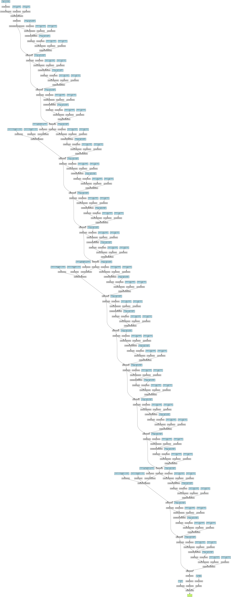
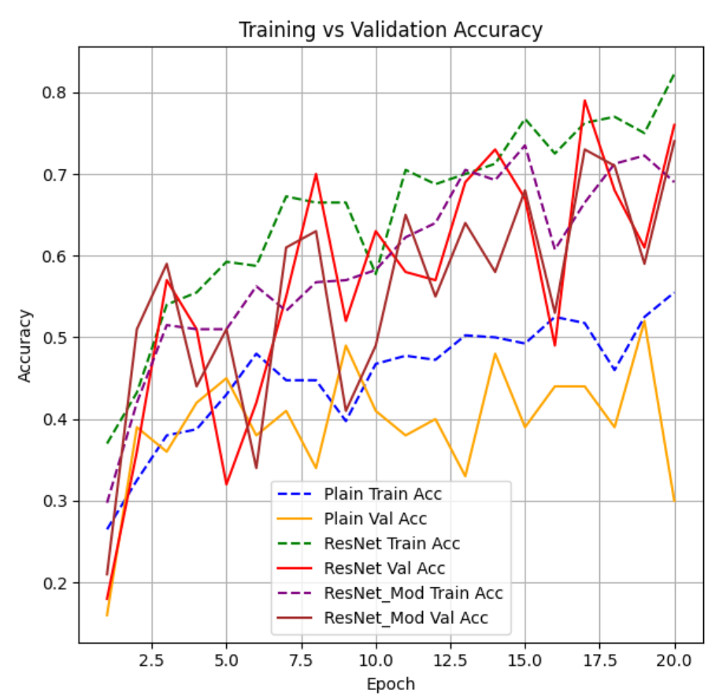
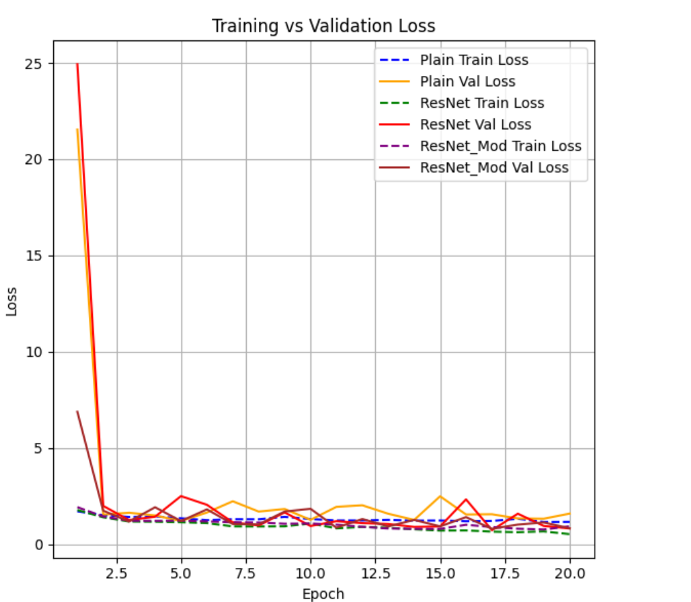

# 📚 Tugas Deep Learning
## ✨ Judul: Perbandingan Plain34, ResNet34, dan ResNet34_Modified dalam Klasifikasi Citra Makanan

---

### 👥 Kelompok
- **Nama Kelompok**: KuYoJo  

### 👤 Anggota
1. Yohanna Anzelika Sitepu (122140010)  
2. Kayla Chika Lathisya (122140009)  
3. Joy Daniella (122140039)  

📅 **Semester**: Ganjil 2025  
🏫 **Institut Teknologi Sumatera (ITERA)**  
📘 **Mata Kuliah**: IF25-40401 – Deep Learning  

---

## 📖 Deskripsi Tugas
Tugas ini bertujuan untuk memahami **masalah degradasi pada deep plain network**, mengimplementasikan solusi dengan **residual connection**, serta melakukan **modifikasi arsitektur** untuk meningkatkan performa.  

Dataset: **500 citra makanan Indonesia** dengan 5 kelas (`bakso, gado_gado, nasi_goreng, rendang, soto_ayam`).  

Model yang dieksperimenkan:
- **Plain34** → baseline 34 layer tanpa residual connection.  
- **ResNet34** → arsitektur standar dengan residual block.  
- **ResNet34_Modified** → modifikasi ResNet34 menggunakan **Mish activation** + **Dropout**.  

---

## ⚙️ Konfigurasi Eksperimen
| Hyperparameter | Nilai |
|----------------|-------|
| Optimizer      | Adam |
| Learning Rate  | 0.001 |
| Batch Size     | 16 |
| Epochs         | 20 |
| Loss Function  | CrossEntropyLoss |
| Input Size     | 224 × 224 |

---

## 🏗️ Arsitektur Model
Visualisasi menggunakan **torchviz**:

📷 *Plain34 Architecture*  

📷 *ResNet34 Architecture*  

📷 *ResNet34_Modified Architecture*  

**Penjelasan Singkat:**
- **Plain34**: Tanpa shortcut → mudah mengalami *vanishing gradient* dan degradasi performa.  
- **ResNet34**: Residual connection menjaga aliran gradien → training lebih stabil & akurasi meningkat.  
- **ResNet34_Modified**: Penambahan Mish + Dropout → aktivasi lebih halus dan regularisasi tambahan.  

---

## 📊 Hasil Eksperimen per Tahap

### 🔹 Tahap 1: Analisis Plain34
- Akurasi training akhir: **55.5%**  
- Akurasi validasi terbaik: **52% (Epoch 19)**  
- Indikasi: cepat overfitting, validasi fluktuatif, degradasi terjadi.  

### 🔹 Tahap 2: Implementasi ResNet34
- Akurasi training akhir: **82.2%**  
- Akurasi validasi terbaik: **79% (Epoch 17)**  
- Analisis: residual connection terbukti **mengatasi degradasi** dan meningkatkan generalisasi.  

### 🔹 Tahap 3: Modifikasi ResNet34 (Mish + Dropout)
- Akurasi training akhir: **73.5%**  
- Akurasi validasi terbaik: **74% (Epoch 20)**  
- Analisis: lebih stabil, tidak terlalu overfit, cocok untuk regularisasi meski sedikit lebih rendah dari ResNet34 standar.  

---

## 📉 Visualisasi Hasil Training

📷 *Grafik Accuracy & Loss*  
  

**Analisis Grafik:**
- **Plain34** → stagnan, validasi tidak konsisten.  
- **ResNet34** → naik tajam, konvergensi stabil.  
- **ResNet34_Modified** → konvergensi lebih lambat tapi stabil, dengan tren validasi yang lebih seimbang.  

---

## ⚖️ Perbandingan Tiga Model

| Model                 | Train Acc (Last) | Val Acc (Best) | Catatan |
|------------------------|------------------|----------------|---------|
| **Plain34**            | 55.5%            | 52.0%          | Cepat overfitting, degradasi akurasi |
| **ResNet34**           | 82.2%            | **79.0%**      | Residual block sukses atasi degradasi, terbaik |
| **ResNet34_Modified**  | 73.5%            | 74.0%          | Lebih stabil dengan Mish + Dropout, cocok untuk regularisasi |

---

## 📈 Detail Hasil Training per Epoch

### Plain34
- Best Val Acc: **52%** (Epoch 19)  
- Akhir: Train **55.5%**, Val **30%**

### ResNet34
- Best Val Acc: **79%** (Epoch 17)  
- Akhir: Train **82.2%**, Val **76%**

### ResNet34_Modified
- Best Val Acc: **74%** (Epoch 20)  
- Akhir: Train **73.5%**, Val **74%**

---

## 🔑 Kesimpulan
1. **Plain34** gagal generalisasi → overfitting, validasi rendah.  
2. **ResNet34** paling efektif → residual connection meningkatkan stabilitas & akurasi.  
3. **ResNet34_Modified** lebih stabil → cocok untuk regularisasi, meski kalah sedikit dari ResNet34 standar.  

👉 **ResNet34 standar** adalah model terbaik untuk dataset ini.  
👉 **ResNet34_Modified** bisa menjadi alternatif jika fokus pada regularisasi & stabilitas.  

---

## 🤖 Peran dan Kontribusi AI Assistant
- Membantu menulis kode arsitektur Plain34, ResNet34, dan ResNet34_Modified.  
- Membantu membuat visualisasi (arsitektur & grafik training).  
- Membantu menyusun laporan dalam format markdown sesuai TOR.  
- Kelompok melakukan verifikasi ulang seluruh kode di Colab dan memastikan hasil eksperimen valid.  

---

## 🔗 Link Source Code
- [Google Colab Notebook](https://colab.research.google.com/drive/1GTeEs8nj1TR9MahRZXU3F50xQzP8GjII)  
- [GitHub Repository](https://github.com/username/repo-name)  
